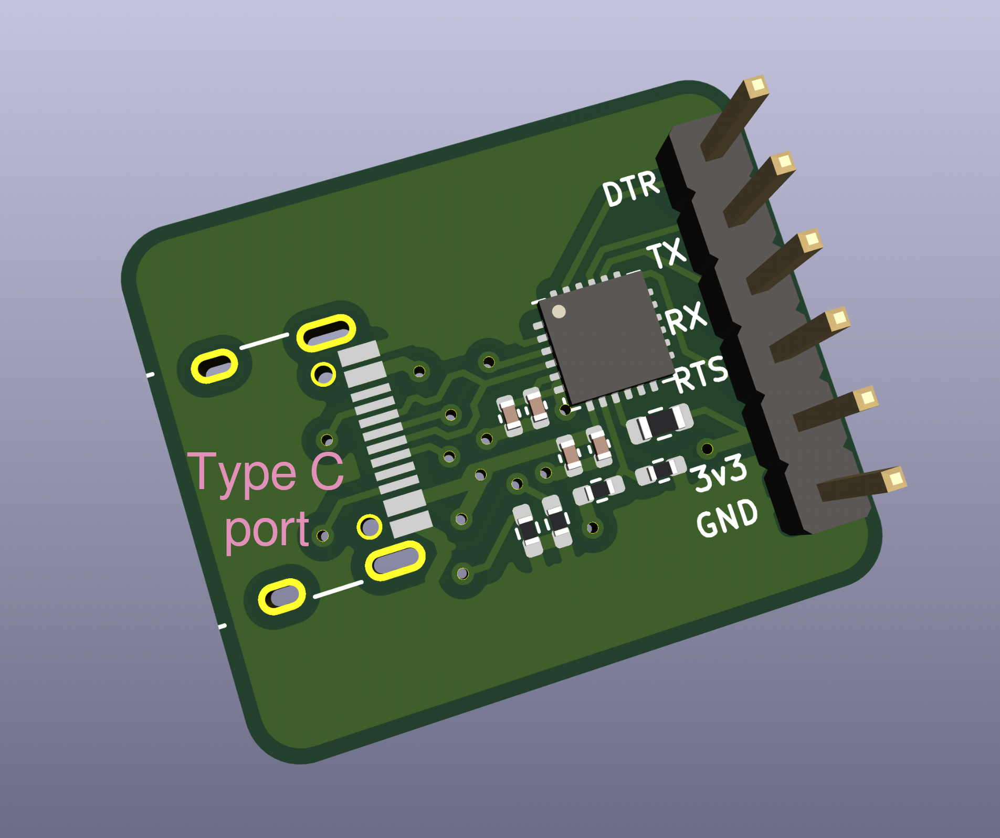

# USB UART TTL for ESP8266

This is a compact CP2102N-based USB Type-C TTL UART breakout board that also includes the DTR and RTS pins needed for button-free programming of the ESP8266.

USB TTL UART adapters available on the market have issues:
- The smaller adapters that have a Type C port don't break out the DTR & RTS pins
- The adapters that do break out DTR & RTS pins also break out a bunch of other unneeded pins, and they're large & bulky. They also have a micro-USB port instead of Type C.

This adapter breaks out all pins needed for efficient ESP8266 development while remaining as compact as possible.

This was created in 2021; the market may have more suitable offerings available at this point.

See [bom.xlsx](bom.xlsx) for the list of parts to order from LCSC or for JLCPCB assembly. [pos.xlsx](pos.xlsx) is the part positioning file for JLCPCB assembly.
